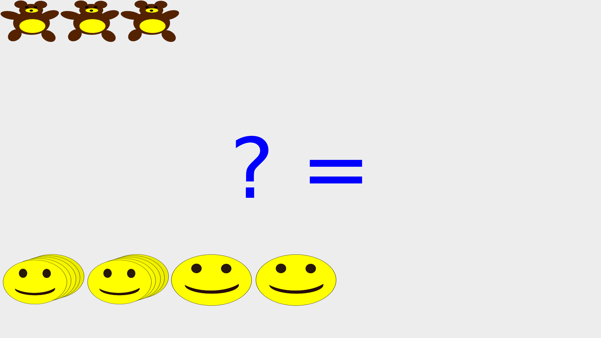
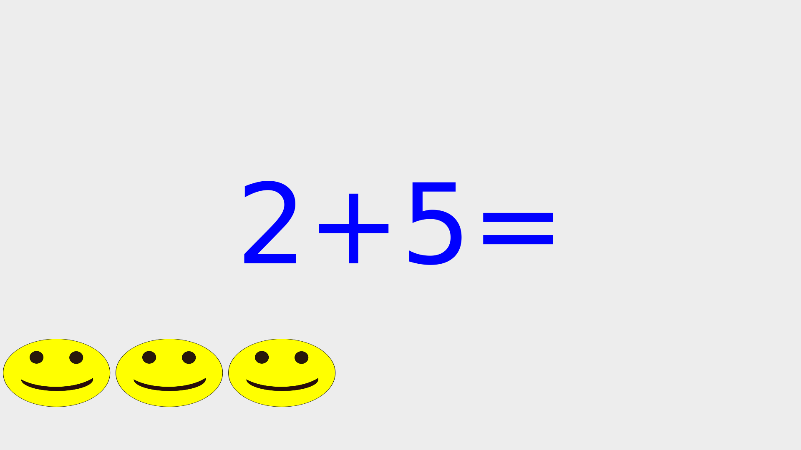
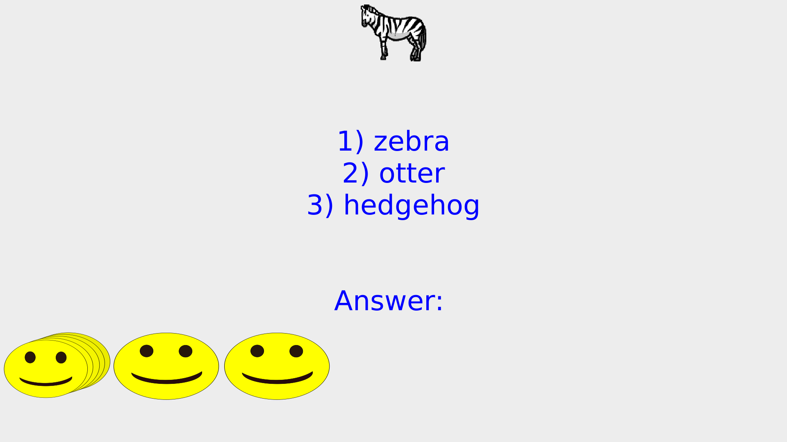
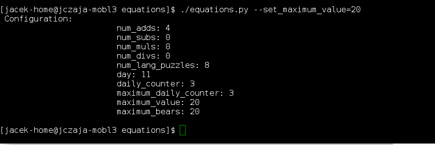

# Equations 
Simple program that aims to generate some mathematical & language puzzles for children and when having puzzles completed then some URL given site is launched (eg. netflix, youtube etc.). 

# Motivation
Having a daughter which said "That was a very good day. I watched a lot of cartoons." , aim of this  project is to use children motivation to watch cartoons for educational purposes.

# Features:
- math puzzels: adding, substracting, multiplication, division, counting
- language vocabulary puzzles: matching a word describing picture with appropriate picture
- Starts a netfix via browser and set timeout for watching, then shutdowns the system
- fully configurable:
  - number of puzzles
  - range of values for math puzzles 
  - number of sessions of watching per day
- With each solved puzzle without mistake, time for watching cartoons is increased by 2 minutes

# Installation
- Ideally this program should run in mouse-less window manager and add to startup scripts.
- Add your children account(s) to sudoers group so at least shutdown can be executed without password 
- install prerequisities

# Testing
Running unit tests"
  python -m pytest -vvv test_equations.py 
Running unit tests with dropping into debugger on failures:
  python -m pytest -vvv test_equations.py --pdb

# Prerequisite
- google chrome
- python2 with pytest-qt, PyQt4
- festival Text to Speech projects
- accound for children with sudo priviligies to shutdown command
- Linux OS

# Screenshots
Counting puzzle:

Math(adding):

language puzzle:

setting maximum value for math puzzles from commandline:

# License
Copyright (c) 2016, Jacek Czaja
All rights reserved.

Redistribution and use in source and binary forms, with or without modification, are permitted provided that the following conditions are met:

1. Redistributions of source code must retain the above copyright notice, this list of conditions and the following disclaimer.

2. Redistributions in binary form must reproduce the above copyright notice, this list of conditions and the following disclaimer in the documentation and/or other materials provided with the distribution.

3. Neither the name of the copyright holder nor the names of its contributors may be used to endorse or promote products derived from this software without specific prior written permission.

THIS SOFTWARE IS PROVIDED BY THE COPYRIGHT HOLDERS AND CONTRIBUTORS "AS IS" AND ANY EXPRESS OR IMPLIED WARRANTIES, INCLUDING, BUT NOT LIMITED TO, THE IMPLIED WARRANTIES OF MERCHANTABILITY AND FITNESS FOR A PARTICULAR PURPOSE ARE DISCLAIMED. IN NO EVENT SHALL THE COPYRIGHT HOLDER OR CONTRIBUTORS BE LIABLE FOR ANY DIRECT, INDIRECT, INCIDENTAL, SPECIAL, EXEMPLARY, OR CONSEQUENTIAL DAMAGES (INCLUDING, BUT NOT LIMITED TO, PROCUREMENT OF SUBSTITUTE GOODS OR SERVICES; LOSS OF USE, DATA, OR PROFITS; OR BUSINESS INTERRUPTION) HOWEVER CAUSED AND ON ANY THEORY OF LIABILITY, WHETHER IN CONTRACT, STRICT LIABILITY, OR TORT (INCLUDING NEGLIGENCE OR OTHERWISE) ARISING IN ANY WAY OUT OF THE USE OF THIS SOFTWARE, EVEN IF ADVISED OF THE POSSIBILITY OF SUCH DAMAGE.

# Additional Notes:
- Images for language puzzles comes from  UVic Humanities Computing and Media Centre and Half-Baked Software  
http://hcmc.uvic.ca/clipart/

